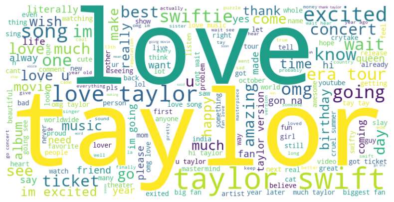

# Taylor Swift vs. BlackPink: A Comparative Analysis Across Reddit and YouTube

## Project Overview

This project aims to explore and compare the global phenomenon of Taylor Swift and BlackPink across Reddit and YouTube. 
By analyzing their digital footprints on these platforms, 
we seek to determine which artist commands a more significant presence and influence. 
The project involves sentiment analysis, text analysis, community detection, and more to provide comprehensive insights.

## Features

- Data Collection: Retrieved data from relevant subreddits and YouTube channels using APIs and web scraping.

- Data Cleaning and Pre-Processing: Handled missing values, removed outliers, and standardized text data, including tokenization, stop word removal, spelling correction, stemming, and lemmatization.

- Text Analysis: Conducted word frequency analysis, term frequency analysis, and generated word clouds to identify key themes and trends.

- Sentiment Analysis: Utilized VADER and TextBlob to assess the sentiment of posts and comments.

- Topic Modeling: Applied Latent Dirichlet Allocation (LDA) to discover hidden topics within the data.

- Community Detection: Created network graphs and performed centrality analysis to understand the structure and influence within the communities.

## Usage

To replicate the analysis:

1. Ensure you have Jupyter Notebook installed.
2. Open the Taylor_Swift_vs_BlackPink.ipynb notebook.
3. Run the cells sequentially to see the analysis process and results.

## Directory Structure

├── data/
│   ├── reddit_blackpink.csv        # Reddit data for BlackPink
│   ├── reddit_taylor_swift.csv     # Reddit data for Taylor Swift
│   ├── youtube_blackpink.csv       # YouTube data for BlackPink
│   ├── youtube_taylor_swift.csv    # YouTube data for Taylor Swift
├── Taylor_Swift_vs_BlackPink.ipynb # Jupyter notebook with analysis and modeling
└── README.md                       # This file

## Sample Data Visualization

For a detailed preview of data visualization, here is the sample output as a scatter plot.

## Contact
For any further questions or feedback, please feel free to reach out.

Thank you for your interest in our Taylor Swift vs. BlackPink comparative analysis project. 
We hope our insights contribute to understanding the digital influence of these global music icons.
